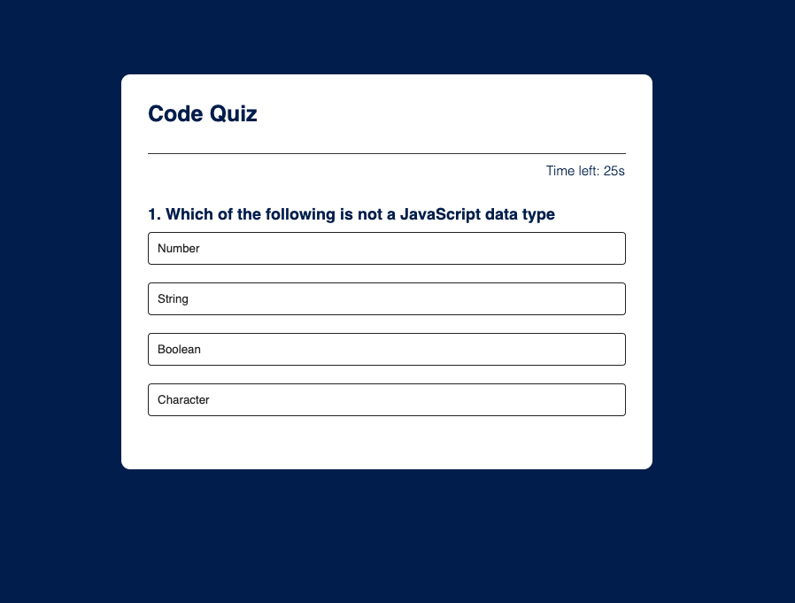

# JavaScript Code Quiz

This is a JavaScript code quiz application that tests your knowledge of coding concepts. The quiz follows the structure outlined below:

## Preview

## Functionality
- **Starting The Quiz**: When you open the page, a timer starts counting down, and you are presented with the first question.
- **Answering Questions**: Once you answer a question, you are presented with the next question.
- **Incorrect Answers**: If you answer a question incorrectly, time is subtracted from the timer.
- **Game Over**: The game ends either when all questions are answered or when the timer reaches 0.
- **Saving Score**: After the game is over, you have the option to save your initials and score.

## How to Use
1. **Starting the Quiz**: Open the page to start the quiz.
2. **Answering Questions**: Read each question carefully and select your answer. Click on the answer you believe to be correct.
3. **Incorrect Answer Handling**: If you select an incorrect answer, 10 seconds will be subtracted from the timer.
4. **Game Over**: The game ends when either all questions are answered or the timer reaches 0.
5. **Saving Score**: After the game ends, you have the options to save your initials and view your score, or play again.

## Code Languages Used
- HTML
- CSS
- JavaScript

## Usage
No installation required. Simply open the website using this link: https://chadoyek.github.io/Code-Quiz/ and get started on the quiz

## Development
This application was developed using JavaScript for the functionality, HTML for the structure, and CSS for styling.

## Credits
This application was created by Chadi Hoyek as a project for EdX Coding Bootcamp, inspired by the need to test and reinforce coding knowledge.

